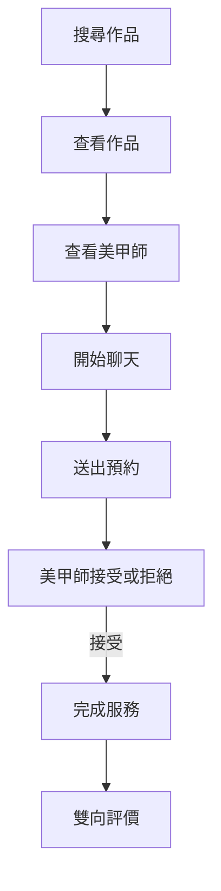
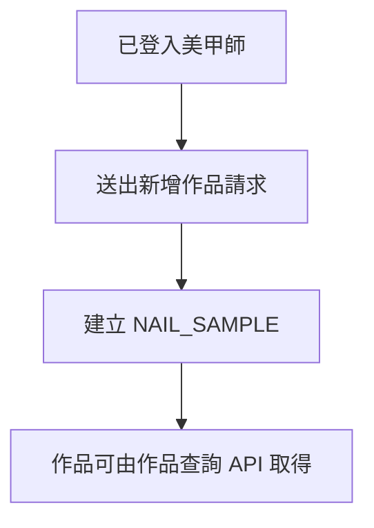
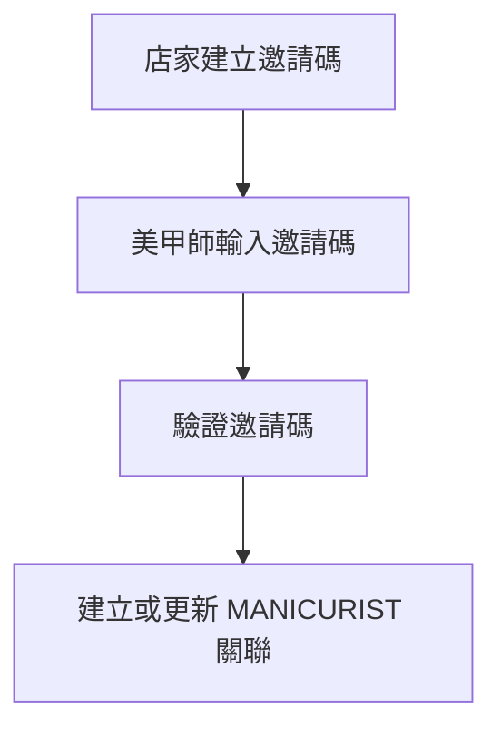

# Core User Flows

## Document Information

| Item | Value |
|------|------|
| Project | Nail SaaS |
| Version | v1.0.0 |
| Status | Review Required |
| Last Updated | 2026-07-28 |

---

## Purpose

本文件描述 Nail SaaS 的核心使用者流程（Core User Flows）。

本文件僅定義使用者操作流程及系統互動，不描述資料表設計、API 規格或商業邏輯。

尚未完成 DDL、API Specification 或 ADR 確認之流程，僅作為產品規劃，不得直接作為程式實作依據。

---

## Flow Status Definition

| Status | Description |
|--------|-------------|
| Planned | 僅為產品規劃，尚未完成設計。 |
| Review Required | 流程已建立，待確認。 |
| Implemented | 流程已完成並可使用。 |
| Deprecated | 流程已停止使用。 |

---

## Core User Flows

| Flow | Description | Status |
|------|-------------|--------|
| Member Reservation Journey | 會員完整預約流程 | Review Required |
| Manicurist Portfolio Management | 美甲師作品管理 | Review Required |
| Shop Invitation | 店家邀請美甲師 | Review Required |

---

## Member Reservation Journey

### Goal

描述會員從搜尋作品到完成服務的完整產品流程。

### Flow

### Current Status

目前聊天、預約處理及雙向評價流程尚未完成設計。

相關 DDL、API Specification 及商業規則仍待確認，因此本流程僅代表產品目標，不得直接作為程式實作依據。

---

## Manicurist Portfolio Management

### Goal

描述美甲師新增作品的基本流程。

### Flow

### Current Status

目前僅完成作品資料建立流程。

以下功能尚未完成設計：

- 圖片上傳
- 發布狀態管理
- Tag 管理
- 權限驗證
- 作品修改與刪除

---

## Shop Invitation

### Goal

描述店家邀請美甲師加入店家的流程。

### Flow

### Current Status

目前邀請碼機制已完成基本資料模型。

以下功能仍待確認：

- 邀請碼有效期限
- 邀請碼失效機制
- 重複加入處理
- 權限驗證
- 錯誤處理流程

---

## Future User Flows

目前規劃但尚未建立完整流程：

- 預約取消流程
- 預約改期流程
- 美甲師拒絕預約流程
- 預約聊天流程
- 黑名單管理流程
- 收藏作品流程
- 收藏美甲師流程
- 通知推播流程
- 優惠活動使用流程
- 評價管理流程

---

## Related Documents

| Document | Purpose |
|----------|---------|
| Project.md | 專案定位與產品目標。 |
| Module-Catalog.md | 功能模組總覽。 |
| System-Architecture.md | 系統架構。 |
| Table-Catalog.md | 資料表總覽。 |
| API-Catalog.md | API 模組總覽。 |
| ADR | 架構決策紀錄。 |

---

## Notes

- 本文件描述使用者流程，不描述資料模型或 API 實作。
- 新增或修改使用者流程時，應同步更新本文件。
- 流程涉及資料表或 API 異動時，應同步更新相關文件。
- 尚未完成設計或審核之流程，不得直接作為程式開發依據。