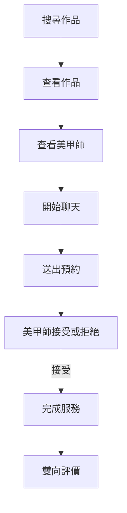
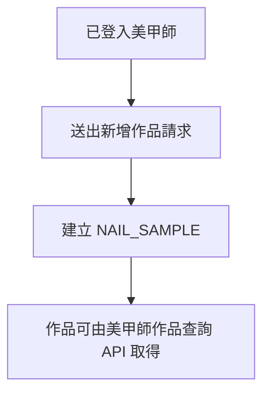
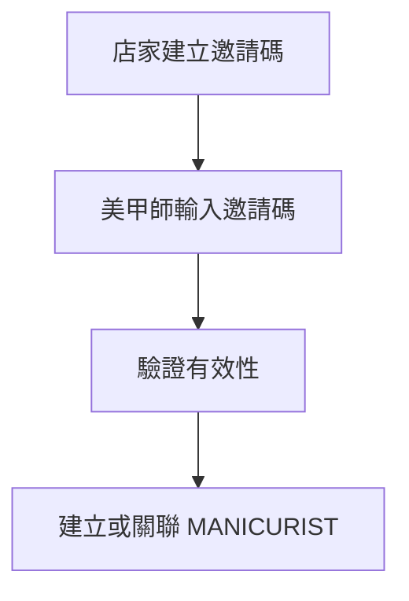

# 核心使用者流程

## 會員服務旅程（產品目標，待確認）

```mermaid
flowchart TD
  A[搜尋作品] --> B[查看作品]
  B --> C[查看美甲師]
  C --> D[開始聊天]
  D --> E[送出預約]
  E --> F[美甲師接受或拒絕]
  F -->|接受| G[完成服務]
  G --> H[雙向評價]
```

聊天、預約處理與雙向評價流程尚未完整實作，亦沒有正式 DDL/API；此圖是待確認的產品流程，不能據此直接撰寫程式。

## 美甲師新增作品（實作盤點）

```mermaid
flowchart TD
  A[已登入美甲師] --> B[送出新增作品請求]
  B --> C[建立 NAIL_SAMPLE]
  C --> D[作品可由美甲師作品查詢 API 取得]
```

圖片上傳、發布狀態、Tag 選擇與權限檢查尚未有確認文件。

## 店家邀請美甲師（實作盤點）

```mermaid
flowchart TD
  A[店家建立邀請碼] --> B[美甲師輸入邀請碼]
  B --> C[驗證有效性]
  C --> D[建立或關聯 MANICURIST]
```
